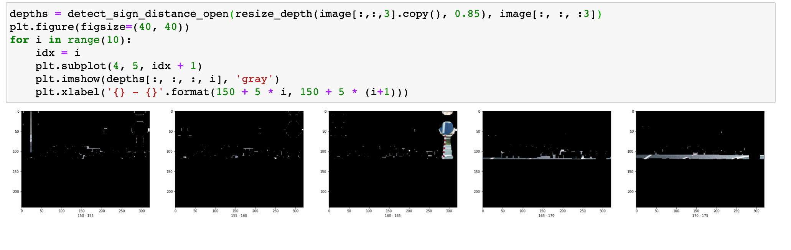

# Cuộc đua số 2019-2020
Ok xin chào các bạn, đây là Khôi đến từ Little Fat Boys, một trong hai đại diện đến từ Đà Nẵng trong cuộc thi vừa qua, chúng mình đáng tiếc đã dừng chân ở vị trí thứ 5 của bảng xếp hạng nhưng hôm nay cũng có một chút chia sẻ về mặt technical gửi đến cho các bạn, hy vọng sau khi xem qua thì các bạn có thể biết được một trong những phương pháp hoạt động của chúng mình để có thể áp dụng vào những bài toán của mình, cũng như là có những đóng góp để giúp cho quá trình phát triển của LFBs có thể được hoàn thiện hơn.

Cuộc đua số là một cuộc thi về những chiếc xe tự hành, được sinh ra để hoạt động trong những điều kiện hoạt động khác nhau và đội mạnh nhất chính là đội có khả năng tạo ra một chiếc xe có khả năng chạy trên những môi trường có độ thay đổi nhất định với tốc độ cao nhất / thời gian ngắn nhất trong khuôn khổ thời gian và luật định của ban tổ chức. Đây là một cuộc thi thu hút được khá nhiều sự quan tâm của sinh viên đến từ cả nước, mặc dù với số lượng tham gia khá ít ỏi, nhưng số lượng quan tâm thì rất cao là tại vì tất cả các business của bài toán này vẫn được đánh giá là có độ khó khá cao so với cơ số các sinh viên. Nhưng không có gì là không thể, áp lực sẽ tạo nên kim cương phải không nào.

Thôi khỏi văn vở nữa, bây giờ chúng ta đi vào vấn đề chính luôn. Việc đầu tiên để cho chiếc xe của chúng ta có thể hoạt động là phải nhận biết được môi trường mà nó cần chạy, và một chiếc xe tốt là một chiếc xe có thể đưa các môi trường khác nhau mà nó chạy thành những môi trường giống nhau mà nó hiểu được, như vậy mới có thể xử lý được.

## Nhận biết bản đồ:
Có khá nhiều phương pháp nhận biết bản đồ được chúng mình đưa vào sử dụng, một số tốt nhất có thể kể đến như là: 

### Segmentation:
Nghe có vẻ hơi chung chung nhỉ, nhưng đây là phương pháp tốt nhất được chúng mình sử dụng ở vòng sơ loại và thời gian đầu của vòng bán kết / chung kết.
Bọn mình đã sử dụng một model có tuổi đời khá cao là Unet để segment tất tần tật mọi thứ mình cần quan tâm trong vòng sơ loại: Đường đi, line đường, biển báo, vật cản, và những thứ còn lại, chi tiết về output của quá trình này thì mình sẽ trình bày sau.

Nhưng mà để ra được ảnh đầu ra như thế này không phải là một câu chuyện đơn giản, trước đây thì bọn mình chỉ segment ra "đường đi được" và dùng loss là iou, thì mình có được một cái đầu ra khá là đẹp đẽ và sắc nét:

Nhưng khi chúng mình bắt đầu thêm những class khác vd như biển bảo hay đường đi được vào để train thì đầu vào của chúng mình thuộc dạng "hên xui", đó là tại vì vấn đề class imbalance khá cao trong dữ liệu train, khi mà với 1000 ảnh thì chúng ta có 1000 cái nhãn của đường đi, 20 ảnh của vật cản và 50 ảnh của biển báo. Vậy nên bọn mình đã đưa ra giải pháp là sử dụng một hàm loss khác, tên là weighted-categorical-crossentropy, các bạn có thể tìm hiểu sâu hơn về hàm loss này nhưng ở đây thì chúng ta sẽ hiểu là đây là một hàm loss có weight cho từng class, vậy thì hiểu nôm na là chúng ta sẽ hướng sự "quan tâm" của quá trình train đến với những cái class có số lượng ít khiến cho chúng khỏi bị "lãng quên".

Sau khi áp dùng hàm loss này thì chúng mình đã có được một output có đầy đủ các class mà chúng mình mong muốn, nhưng vấn đề là chúng không còn được sắc nét như khi sử dụng hàm loss là iou, ví dụ như ở đây mình sẽ show ra output của 3 layer: đường đi, biển báo và vật cản, các bạn có thể thấy là nó mặc dù có thể "nhìn được" nhưng chúng chứa một lượng nhiễu rất lớn đến mức không cần thiết (ừ không phải là video bị mờ đâu, đó là output của model đấy):

Vậy giải pháp đưa ra khá đơn giản là chúng ta sẽ kết hợp cả 2 hàm loss này thành một và gọi nó là weighted-iou. Và chúng ta sẽ có một cái đầu ra như thế này đây. Mặc dù nhìn qua bằng mắt thường chúng ta sẽ thấy cả 2 output là khá giống nhau, nhưng nếu nhìn kỹ thì chúng ta dễ dàng nhận thấy rằng output sau khi train bằng hàm loss kết hợp đã có một độ sắc nét cao hơn nhiều so với output lúc đầu, và điều này là rất tốt cho quá trình xử lý phía sau bởi vì chúng ta không cần phải tốn thời gian cũng như là tài nguyên để khử nhiễu nữa

### Lane segmentation:
Nhưng nhận biết là một chuyện, chúng ta đang làm dự án về xe tự hành, nghĩa là model của chúng ta phải chạy với tốc độ nhanh nhất có thể, bọn mình có được một kết quả khá tốt với model Segmentation base trên unet mà mình nói ở trên (~30fps) ở trên con máy 6 năm tuổi dùng card 980Ti, nhưng khi đưa vào con hàng TX2 của BTC thì chúng ta có được một tốc độ cực kỳ đáng nể: 5fps ở chế độ mạnh nhất :D, vậy thì việc làm của chúng mình bây giờ là phải tối ưu hoá cái model này nếu muốn tiếp tục sử dụng segmentation. Nhưng mà ở sân của btc thì bài toán không còn dễ dàng như ngày xưa khi chúng ta chỉ cần chạy vào tim đường là được, chúng ta phải chạy ở làn đường bên phải (nếu có) và tất nhiên luật lệ về giữ làn đường cũng nghiêm ngặt hơn, vậy thì chúng mình chuyển từ segment tất cả mọi thứ, sang thành segment lane đường, và đưa biển báo cùng với vật cản sang một model detect khác.

Sau khi tìm cách tối ưu hoá mô hình, thì chúng mình cũng đã có được một mô hình đủ hợp lý để chạy ở trên jetson tx2, là model FCN và được chúng mình optimize, model declaration các bạn có thể tìm ở file [FCN Model](offline_codes/segmentation_training/Models/Unet.py), ở trên con máy 980Ti của mình, chúng mình đã đưa được model Unet với tốc độ là 30 fps thành model FCN với tốc độ ~300 fps, và đầu ra được coi là "như nhau", hiển nhiên chúng mình cũng đã áp dụng một số phương pháp để giảm tải cho tài nguyên vd như giảm kích thước ảnh, giảm các layer upsample, vâng vâng.

Bọn mình cũng đã thử rất nhiều những model khác nhau, ví dụ như trong video này là Enet, FCN25, Refinenet, tất cả bọn chúng đều được chúng mình optimize và test thử tốc độ, với kết quả các bạn có thể xem được dưới đây, video này được train và test trên data của cuộc đua số 2018-2019, bởi vì lúc làm những cái này bọn mình chưa build xong sân tập chính của cuộc đua số 2019-2020 =)))

### Detection:
Chúng mình sử dụng tổng cộng là 3 phương pháp detection chung cho cả biển báo và vật cản
#### Segment + classification:
Đây là phương pháp được sử dụng trong vòng sơ loại, như đã nói ở trên, chúng mình đã phân segment ra được các biển báo và vật cản với độ sắc nét khá cao, sau đó chúng mình sẽ sử dụng connected_components để tách từng vật thể ra, sau đó chúng ta sẽ tìm vật có kích thước cao nhất và đưa vào classificatoin.
Phương pháp này thì chúng mình không dùng depth vào để nhận biết, nhưng nếu sử dụng cắt lớp depth (mình sẽ giải thích kỹ hơn sau) thì chúng mình sẽ có hiệu suất phân biệt cao hơn và sẽ tránh được những trường hợp như cái biển báo giả được in trên xe, vâng vâng.

#### Depth-masked-layered classification:
Phương pháp này mới chỉ được chúng mình đưa ra dưới dạng concept/POC chứ chưa đủ thời gian để áp dụng vào xe, cụ thể là, chúng mình sẽ dựa vào ma trận depth của camera, sau đó chúng mà sẽ cắt từng lớp có depth từ 100-250, vd như 100-110, 105-115, ... với từng layer depth như vậy, chúng ta sẽ dùng nó làm mask cho ảnh rgb và đưa ảnh này vào mô hình classification, vậy chúng ta sẽ biết được biển báo nằm ở đâu và depth của nó luôn.
Ví dụ như các bạn có thể thấy trong 5 bức ảnh này, mỗi bức ảnh được cắt ra từ mask là một khoảng depth khác nhau, vậy chúng ta sẽ có một chiếc biển báo nằm ngay ngắn và gọn gàng ở trong mask của chính nó, sau này chúng ta sẽ khử nhiễu cho những bức ảnh này bằng cách apply opening/closing cũng như là median blur hoặc những phương pháp khác, sau đó chúng ta sẽ zoom mask depth lên khoảng 110% để chắc chắn rằng biển báo của chúng ta sẽ nằm ở bên trong cái mask này

Tuy nhiên ở mức POC thì phương pháp này chỉ có độ chính xác ~60% với mức nhiễu khá cao, và với tốc độ của xe team tụi mình (các bạn thấy ở lúc thi thử rồi đấy) thì ảnh sẽ quá nhiễu đến mức khó có thể thấy được quả biển báo, và cũng không có nhiều thời gian để coding cũng như testing, nên chúng mình quyết định cho phương pháp này dừng bước ở mức POC

#### Object detection:
Phương pháp này thì được bọn mình sử dụng ở vòng chung kết, mặc dù đối với các bạn nó không có gì quá đặc biệt nhưng với model chúng mình sử dụng (tiny-yolov4) thì nó cũng có được một hiệu suất khá cao khi detect 10 class (building, trụ cờ, 2 biển cấm rẽ, 3 biển chỉ hướng, xe bus, người đi đường, và biển stop) và tốc độ rơi vào tầm 30~40fps khi chạy song song với các model segmentation. Code cho model này thì mình để ở máy trạm ở nhà nên mình sẽ cố gắng update trong thời gian sớm nhất. Như các bạn cũng đã biết thì bọn mình ngoài việc chaỵ nhanh quá dẫn đến quay xe không kịp thì bọn mình gặp khá nhiều vấn đề với mớ biển báo khi model của tụi mình liên tục bị overfit, vậy nên tụi mình cũng không nên chia sẻ nhiều về model biển báo này.

Hình như hết rồi :))) sau này mình có nhớ ra thêm cái gì thì mình thêm vào sau haha

## Triển khai
Nhận biết được bản đồ là một chuyện, triển khai được nó ra là một chuyện khác, nói riêng về model đánh lái thì bọn mình có ở đây khoảng 5 phương pháp khác nhau để triển khai nó, ví dụ nhé:

### Ma trận khoảng cách:
Đây lại là phương pháp được bọn mình sử dụng trong vòng sơ khảo, nói cho dễ hiểu thì, với kết quả segmentation, bọn mình sẽ chiếu một ma trận 10 tia ở 2 bên, để tính khoảng cách từ xe đến lề phải và lề trái của đường đi, dựa vào độ lệch nhau của chúng, bọn mình sẽ tính được răng xe đang lệch qua trái/qua phải bao nhiêu, sau đó thì áp dụng một chút fuzzy logic và PID để tính ra góc rẽ của xe

Phương pháp ma trận khoảng cách này thì dễ dàng giúp tụi mình có được chức vô địch vòng sơ khảo tại điểm thi Đà Nẵng, với khả năng vận hành mượt mà và không cần coding quá nhiều, mặc dù bọn mình đưa ra phương pháp này với khá nhiều kỳ vọng là sẽ áp dụng deep reinforcement learing vào, nhưng vì simulator của BTC không trả về được sự kiện xe bị đâm đụng hay reset nên phương pháp này chỉ được dừng lại ở đây

### Deep Q Learning based:
Trong quá trình tìm hiểu về deep reinforcement learing cho phương pháp ở trên thì chúng mình có một cái suy nghĩ như thế này: "Thay vì chúng ta lập trình cho chiếc xe chạy một cách logic theo toán học, mà rõ ràng là con người không hề lái xe như thế, thay vì vậy thì chúng ta cho nó một nửa logic bằng cách chúng ta dạy cho nó chạy trong thời gian đầu, thời gian sau nó sẽ tự học được cách mà tự lái". Ừ lúc đầu mình kể cho mấy thằng team mình thì chúng nó cứ kiểu "M bị điên à ku", nhưng đây là cách mà chúng mình dùng để chạy ở vòng chung kết, với tốc độ cao nhất đạt được là 21s ở map màu đỏ.

Gọi là based vì ở đây không phải là bọn mình dùng Deep Q Learning, bọn mình chỉ sử dụng một cái gọi là "lý thuyết giản lược" của nó, và bọn mình triển khai bằng cách, trong thời gian đầu, mình sẽ cầm remote và lái chiếc xe đó, chiếc xe sẽ thu thập dữ liệu do chính mình lái và học chúng, vậy thì sau này khi nó tự lái, nó cũng lái y chang như thằng chủ của nó đang cầm remote vậy, nó lái giống đến mức anh BTC phải nói rằng "chú lái thì cẩn thận đừng để tông trúng tường" nhưng thật sự lúc đó là xe tự chạy chứ không phải do mình lái =))) Vậy thì đây cũng chỉ là một câu chuyện supervised learning đơn giản thôi.

Để có thể xem về việc working với data của tụi mình thì các bạn có thể xem qua tập data của bọn mình thiết kế, nó rất đơn giản với tên file có dạng "id ảnh"x"tốc độ"x"góc lái", đây cũng chính là nhãn được đưa vào quá trình training để cho model học theo cách mà chúng ta đánh lái

### Model Predictive Control:
Cái này thì cũng nên được gọi là "based" như deep Q ở trên, tại vì mình cũng chỉ sử dụng lý thuyết của MPC vào đây chứ không phải 100% là thuật toán MPC, nói về MPC thì mọi người có thể hiểu đơn giản là, chúng ta sẽ cố gắng dự đoán rằng, với output của hiện tại, thì trong một khoảng thời gian delta-t sau đó, chiếc xe sẽ phản hồi như thế nào, có gặp lỗi gì không, sẽ ở vị trí nào, ... Vậy chúng mình áp dụng chúng như thế nào, các bạn có thể thấy rõ nhất là ở vị trí này của của 2 map: 

Vị trí này thì theo mình là vị trí cua khét nhất của cả 2 map, khi xe mình đang đóng thẳng max speed thì phải hãm lại rất nhanh và rất hay bị chệch làn đường ở đây, bọn mình đã triển khai khả năng hãm xe khi đạt góc lái lớn ở trên toàn bộ bản đồ, nhưng phương pháp này không hiệu quả bởi vì nếu như vậy, bạn có thể thấy là chiếc xe chỉ hãm lại ở trong những vị trí này:

Nhưng thật sự thì chiếc xe chỉ nên hãm lại trong những vị trí này:

Tại vì, như một chiếc xe bình thưòng thôi, nó chỉ nên hãm lại trước khi vào cua, chứ khi đã vào cua và đang ra cua mà mới hãm lại thì nó sẽ là một cái gì đó rất là "hãm", vậy làm sao để nó biết là nó sắp vào cua để biết đường mà hãm lại, hãy nhìn lại ở trên, chúng ta có model deep Q learning, nó có thể đoán (predict) được rằng lúc nào thì nên bẻ lái, vậy thì chúng ta sẽ rework lại data một tí, model của chúng ta sẽ có 2 output, một output là góc đánh lái trong thời điểm hiện tại (dùng để đánh lái), một output là góc đánh lái trong một khoảng thời gian delta-t tiếp theo, vậy thì chúng ta sẽ tiến hành hãm xe, và tăng tốc xe dựa trên kết quả đánh lái của khoảng thời gian delta-t sau đó, và phương pháp này cho thấy một sự cải tiến rõ rệt khi xe của mình hãm tốc và tăng tốc cực kỳ mượt đếm mức xác suất chệch ra khỏi đường chỉ còn khoảng 1/10, với tốc độ chúng mình test là 35-40. Để dễ hiểu hơn về ý tưởng ở đây chúng ta có thể xem hình này:

Cho trục ngang là trục thời gian và trục dọc là ground-truth của mô hình đánh lái, với đỏ, vàng, và xanh là 3 mốc thời gian cách đều nhau một khoảng là delta-t, delta-t có thể được thay đổi tuỳ vào tốc độ vận hành của xe.

Hãy tưởng tượng rằng xe của chúng ta đang ở điểm màu đỏ, góc lái hiện tại của chúng ta rơi vào khoảng 10 độ, nhìn qua phía trục thời gian tăng lên ta có thể thấy góc lái đang tăng dần vào max, nghĩa là xe của chúng ta sắp sửa vào một pha cua rất khét, nhìn vào điểm màu vàng, chúng ta có một góc lái gần bằng max, và tại điểm màu vàng nhìn sang điểm màu xanh, chúng ta có một góc lái đang tiến dần về 0, nghĩa là chúng ta đang có một pha bẻ cua cực khét đang đợi mình.

Vậy, tại điểm màu đỏ, chúng ta sẽ cố gắng đoán xem, tại điểm màu vàng, góc lái của xe nó sẽ như thế nào. Hay nói một cách khác, vào thời điểm "xe chuẩn bị vào cua", chúng ta sẽ đoán thử góc lái khi xe "đang trong cua" nó sẽ như thế nào, rõ ràng góc lái trong cua sẽ cực kỳ lớn và lớn hơn nhiều so với góc lái khi chuẩn bị vào cua, điều này đồng nghĩa với việc là chúng ta sẽ biết rằng xe của chúng ta sắp có một pha bẻ lái như vậy trong khoảng thời gian delta-t tiếp theo.

Dựa vào dữ liệu này để chúng ta tiến hành hãm tốc độ xe lại, nghĩa là chúng ta sẽ hãm được tốc độ của xe trước khi xe vào trong cua, điều này đặc biệt hiệu quả với những pha cua gắt, và ngoài ra, nhìn vào điểm màu vàng, nghĩa là khi ở trong cua, chúng ta đã đoán được rằng chúng mình chuẩn bị ra khỏi khúc cua (điểm màu xanh), và chúng ta sẽ tiến hành tăng tốc ngay từ lúc này, vậy là chúng ta đã có một khả năng ôm cua cực kỳ mượt ở tốc độ cao đến rất cao, do thời gian gấp rút nên chúng mình vẫn chưa thử tăng tốc độ xe lên khoảng 45-50 xem thế nào, nhưng mình nghĩ nó cũng sẽ hoạt động tốt. 

Nhược điểm của phương pháp mình đã sử dụng trong xe là tại vì mình tính góc lái của xe sau khoảng thời gian delta-t dựa vào chuỗi dữ liệu đã thu được, chứ không phải là có một công thức toán học, nên khi chúng ta thay đổi khoảng thời gian delta-t thì chúng ta phải thay đổi hoàn toàn tập data train và train lại từ đầu, điều này không phù hợp đối với những xe mà có tốc độ gốc thay đổi dần theo thời gian, trong tương lai nếu phương pháp này được phát triển, mình sẽ cố gắng làm ra một công thức linear và logic để xe có thể đoán được góc lái trong tương lai là một khoảng thời gian delta-t tuỳ biến mà không cần phải làm lại data.

Dựa vào trục thời gian như vậy các bạn có thể hiểu được các điểm màu đỏ, vàng, xanh là các điểm mà tại đó, xe của chúng ta sẽ ở các vị trí như sau:

### Sequence image processing:
Trong quá trình nghiên cứu về Deep Q nói riêng và Reinforcement Learning nói chung thì, đối với việc xử lý ở một thời điểm bất kỳ thì rất khó để chiếc xe có thể biết được là nó đang ở một tình trạng như thế nào, nhưng điều này lại trở nên dễ dàng hơn nhiều nếu đầu vào của quá trình xử lý là một chuỗi các tình trạng trong một khoảng thời gian delta-t gần nhất của xe, vd thay vì chúng ta đưa một cái đầu vào là chiếc xe đang rẽ trái, nó cũng chẳng biết là lúc vào rẽ nó có bị vào hơi bị sớm, hay hơi bị trễ không, nhưng điều này sẽ khác nếu chúng ta có đầu vào là một chuỗi ảnh, nó sẽ rất dễ dàng biết được là trong một khoảng thời gian delta-t vừa qua thì tình trạng của mình như thế nào.

Tuy nhiên phương pháp này thì bọn mình cũng chỉ dừng ở mức POC, vì có một vấn đề rằng bọn mình không có được một sequence với timing chính xác ở mọi thời gian được, và việc này cũng cần khá nhiều debugging trong code và bọn mình không có đủ thời gian để làm việc đó, nên cũng chỉ dừng lại ở mức Theory. Nếu có bạn nào thành công trong việc phát triển input sequence này thì mình sẽ rất hạnh phúc khi được chia sẻ cùng các bạn.

### Direct image steering:
Mình xin nói trước là đây là một phương pháp thuộc dạng "chữa cháy" mà mình không khuyên các bạn sử dụng, rằng là tại vì model detect biển báo của chúng mình vừa nói ở trên không có một kết quả như mong đợi, nghĩa là ở 2 cái ngã 3 cuộc đời mà btc giao cho thì bọn mình hầu như không phân biệt được mà phải dựa vào các biển báo để tính ra lối đi, nhưng biển báo lại không chạy, vậy thì làm sao đây, bọn mình đã bỏ qua mô hình segment line đường và bọn mình đáp luôn ảnh thu trực tiếp từ camera để biết đường rẽ :)))), vì nếu làm như thế này, chúng mình sẽ dễ dàng thấy được cỏ ở 2 bên đường để biết là phải rẽ theo hướng nào, nhược điểm của phương pháp này là nó cực kỳ nhạy cảm với sự thay đổi của môi trường, chỉ cần có một bạn nào đứng trước mũi xe là nó bắt đầu hành tung kỳ lạ rồi, nhưng nếu các bạn có muốn tìm một phương pháp chữa cháy thì đây cũng là một cách mà các bạn nên thử.

## Chia sẻ thêm:
Nói về các phương pháp nhận biết bản đồ thì chúng mình cũng đã thử khá nhiều phương pháp nhưng trên đây là những phương pháp cho độ tin cậy và tốc độ cao nhất, cũng là một sự thiếu sót khi mình không quay lại nhiều video để cho mọi người có thể tham khảo.

Cả 4 phương pháp triển khái thì đều có ưu nhược điểm riêng của chúng, phương pháp ma trận khoảng cách của tụi mình có khả năng vận hành mượt mà, tránh được những pha đánh lái đi thẳng vào lề đường, nhưng không có hiệu quả cao đối với nhữnng pha cua siêu gắt như ở phần đường một chiều của hai sân, Deep Q thì cũng có khả năng vận hành mượt mà đúng lúc và gắt gỏng đúng chỗ, nhưng chúng ta cũng cần phải huấn luyện bằng tay cho nó ở những bước đầu, thành ra mặc dù có độ ổn định cao, nhưng khá là tiêu hao sức lực, predictive thì giúp cho xe vận hành mượt mà hơn nhiều nhưng lại yêu cầu khá nhiều dữ liệu và khó có thể áp dụng cho bài toán online training. Phương pháp cuối cùng thì dùng chữa cháy thôi chứ nếu áp dụng lên một chiếc xe thật thì không ổn.

Và mình mong muốn sẽ có một cái simulator nào đó để mình có thể áp dụng reinforcement learning vào để có thể có được một mô hình đánh lái tốt nhất sử dụng các theory được nêu ở trên. Nếu các bạn có ý tưởng nào để phát triển chúng, hãy chia sẽ cho mình vì điều đó thật tuyệt dời.

Trong kỳ thi năm nay thì bọn mình cũng chưa đọc kỹ đề nên quên rằng chúng ta sẽ có cái vách ngăn nằm giữa 2 sân thi đấu, tại vì nếu sử dụng cái vách ngăn này để xác định khoảng cách thì bọn mình có thể có hiệu suất rẽ tốt hơn là dùng cái phương pháp củ chuối kia

Các bạn nên sửa lại package của btc một chút để có hiệu suất phanh xe tốt nhất khi gặp biển stop, bọn mình phải đau đầu hẳn 2 ngày khi xe của bọn mình cứ bị trôi mỗi khi stop, sau khi thi xong rồi mình mới được team LHP chỉ cho phương pháp khoá bánh xe cực khét để nâng cao hiệu suất hãm xe, cái này mà biết trước thì ngon :))))

Các bạn nên có một sự quan tâm nhất định về vấn đề dây nhợ, nhất là dây nguồn, Little Fat Boys trong trận đấu cuối cùng của mình đã bị sứt mất sợi dây nguồn khi đang chạy và không có khả năng reset lại xe nữa, mình nghĩ nếu sợi dây đó không sút ra thì bọn mình hoàn toàn có khả năng tiến sâu hơn là top 5 =))) nhưng mà thôi, dù gì cũng là do sự bất cẩn của bọn mình nên cũng không thể trách ai được.

Vậy là đã kết thúc một mùa Cuộc đua số, hy vọng rằng năm sau btc sẽ tiếp tục tổ chức CDS thêm một lần cuối cùng để Little Fat Boys có thể quẩy trên sàn đấu của BTC một lần cuối cùng trước khi tốt nghiệp =))) Cũng cảm ơn FPT và các nhà tài trợ đã tạo ra một sân chơi rất bổ ích cho các bạn sinh viên.